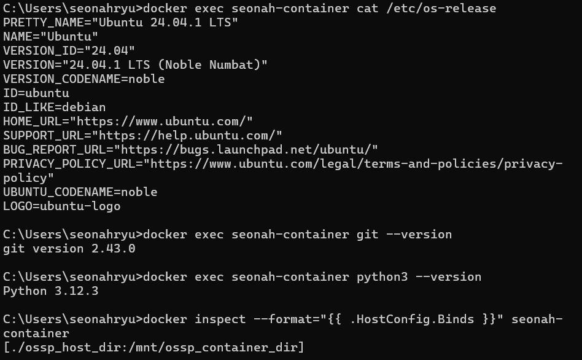

# SWE_2021_41_2024_2_week_6
---
## Week 4 Assignment
* [Link of my repository](https://github.com/seonahryu/SWE_2021_41_2024_2_week_4)
> <code>
> def isHappy(n):
>  def square(num):
>    return sum(int(i)**2 for i in str(num)) #sum of the squares of its digit
>
>  cycle=set() #중복X set
>
>  while n != 1:
>    if n in cycle: #loops endlessly in a cycle
>      return False
>    cycle.add(n)
>    n=square(n)
>  return True
>
>print(isHappy(19))
>print(isHappy(2))
> </code>
* This code defines a function to determine if a number is "happy," meaning that repeatedly summing the squares of its digits will eventually lead to 1.
---
## Week 5 Assignment
>> <code> docker run <options> --name <container_name><image_name> </code>
> * crerate docker container named "<container_name>" from images "<image_name>"
>> <code> docker attach <container_name> </code>
> * attach your terminal to the container
>> <code> docker stop <container_name> </code>
> * stop the running container
> * status changed to 'Exited' from 'Up (running)'
>> <code> docker start <container_name> </code>
> * start the exited/created container
> * status changed to 'Up (running)' from 'Created' or 'Exited'
>> <code> docker pause <container_name> </code>
> * pause the running container
>> <code> docker unpause <container_name> </code>
> * unpause the paused container
>> <code> docker rm <container_name> </code>
> * delete the 'stopped' or 'created' containers
> * with force option(-f), can delete containers in all status
>> <code> docker commit <container_name><image_name>:<tag> </code>
> * commit the container to given image name with tag
>> <code> docker run -dit --name ossp-container -v <host_dir_path>:<container_dir_path> ossp </code>
> * mount <host_dir> to <container_dir> and then share the files
>> <code> docker exec <your container> cat /etc/os-release </code>
> * Displays the operating system details of the specified container.
>> <code> docker exec <your container> git --version </code>
> * Checks the installed version of Git in the specified container.
>> <code> docker exec <your container> python3 --version </code>
> * Displays the installed version of Python 3 in the specified container.
>> <code> docker inspect --format="{{ .HostConfig.Binds }}" <container_name> </code>
> * Retrieves the bind mount information for the specified container.

